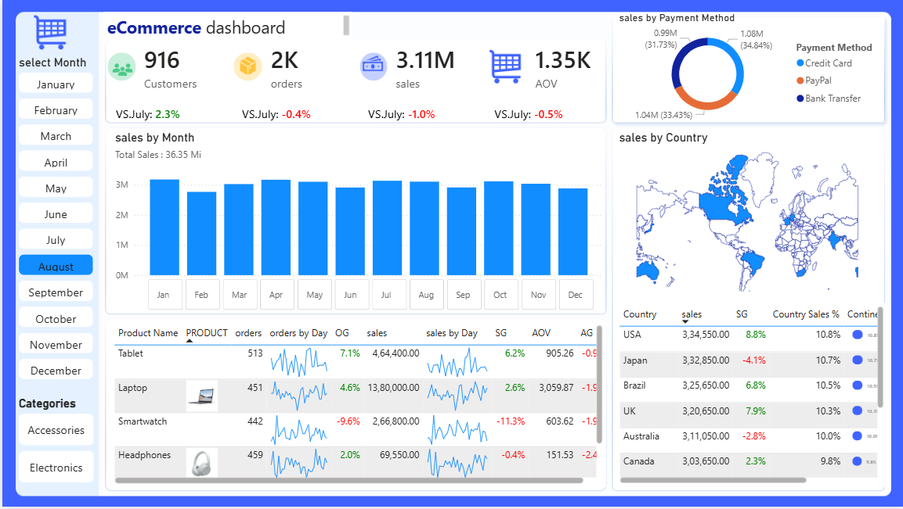

# 🛒 E-Commerce Sales Analysis Dashboard

Power BI dashboard analyzing e-commerce sales performance, customers, orders, products, payment methods, and geographical sales.

## 📌 Project Overview

This project analyzes e-commerce sales data to understand sales trends, customer behavior, product performance, payment methods, and country-wise sales.

The dashboard helps identify important business trends and supports data-driven decision-making.

## 🛠️ Tools Used

- Power BI
- Power Query
- DAX
- Data Visualization
- Data Analysis

## 📊 Key KPIs

- Total Customers: 916
- Total Orders: 2K
- Total Sales: 3.11M
- Average Order Value (AOV): 1.35K

## 📈 Dashboard Analysis

The dashboard provides analysis of:

- Monthly sales trends
- Sales by payment method
- Country-wise sales
- Product performance
- Customer performance
- Order trends
- Average Order Value

## ❓ Business Questions

- Which months generate the highest sales?
- Which payment method contributes the most sales?
- Which countries generate the highest sales?
- Which products receive the most orders?
- How does Average Order Value vary across products?
- How are sales changing over time?

## 💡 Key Insights

- Total sales reached approximately 3.11M.
- The dashboard tracks around 2K orders from 916 customers.
- Credit Card, PayPal, and Bank Transfer are the major payment methods.
- Sales performance varies across countries and products.
- Monthly sales trends help identify stronger and weaker periods.

## 🖼️ Dashboard Preview

## 📁 Project Files

- `E-Commerce Sales Analysis.pbix` — Power BI dashboard file
- `ecommerce-dashboard.png` — Dashboard screenshot

## 🎯 Business Recommendations

- Focus on products with high sales and orders.
- Plan promotions during months with strong sales.
- Improve sales in countries with lower performance.
- Promote popular payment methods for a better customer experience.
- Use cross-selling and upselling to increase Average Order Value.
- Monitor sales trends regularly to identify changes in customer demand.

## 🎯 Project Objective

The objective of this project is to analyze e-commerce sales data and create an interactive Power BI dashboard that provides meaningful insights into sales, customers, products, orders, payment methods, and geographical performance.
